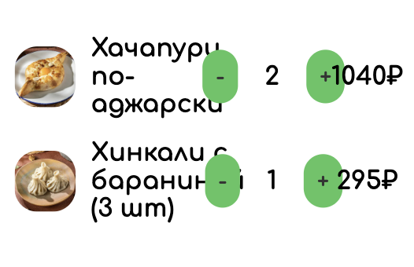

# Корзина

## Страница корзины

### Функционал
- В пустой корзине отображается надпись "Ваша корзина пуста :(".
- Добавление блюд в корзину со страницы ресторана или из рекомендаций в корзине ведет к обновлению списка блюд на странице корзины.
- В навбаре на странице корзины не отображается иконка корзины и поиск.
- Кнопки "+" и "-" соответственно добавляют и удаляют из корзины одну единицу блюда.
- Если в корзине одна единица блюда, то нажатие на "-" удаляет его из корзины и из списка на странице корзины.

### Верстка

- Кнопки "В корзину", "+" и "-" затемняются при наведении и нажатии.
- Баг. При ширине экрана меньше 800px кнопки меняют ширину и слишком сильно приближаются к названиям блюд, при дальнейшем уменьшении - налезают на них.

    

- Баг. Большое количество блюд в корзине увеличивает высоту страницы корзины. Ожидается, что высота корзины ограничена высотой страницы, при превышении появляется скрол.

    https://cloud.mail.ru/public/7BD8/q56r2JUbS

- Баг. Изменение счетчика блюда меняем положение кнопок и они дергаются. Ожидание, под счетчик выделено столько места, чтобы вместить трехзначное число.

    https://cloud.mail.ru/public/tpZF/Q7qcfqerp

## Рекомендации в корзине

### Фунционал

- Список рекомендаций к заказу отображается под списком блюд на странице корзины.
- При добавлении блюда из списка рекомендаций оно появляется в списке блюд корзины и пропадает из рекомендаций.
- Баг. В списке рекомендаций отображаются все блюда ресторана, кроме тех, что уже в корзине. Ожидается отображение ограниченного набора самых подходящих блюд.

### Верстка

- Баг. Элементы карточки блюда налезают друг на друга при небольшой ширине экрана до перехода к мобильной верстке, шрифты не масштабируются.

    
