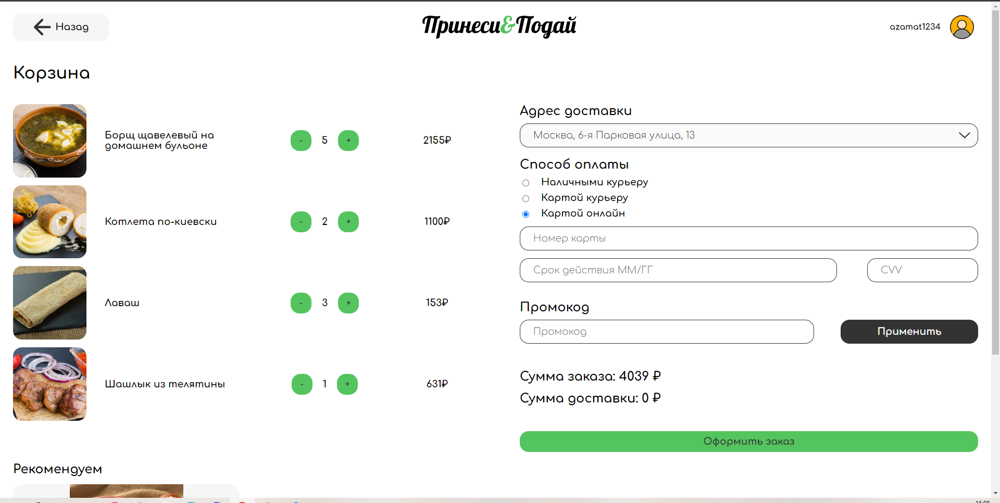

## Оформление заказа

**Десктоп браузер** - _Google Chrome 121.0.6167.185_ 

**Телефон** - _IOS Google Chrome 121.0.6167.185_

## Адрес и способ оплаты

- Нельзя оформить пустой заказ
- Нельзя оформить без адреса доставки
- Можно оформить с адресом и способом оплаты - наличными
- Можно оформить с адресом и способом оплаты - картой курьеру
- При изменении радиокнопки на карту онлайн выпадает форма заполнения карты
- При изменении радиокнопки с карты онлайн исчезает форма заполнения карты
- Если все валидации оформления пройдены, кнопка "Оформить заказ" редиректит на страницу профиля с историей заказов

## Заполнение карты

- Для оформления заказа необходимо заполнить все поля
- В поле номера можно ввести только цифры
- **Bug** можно ввести меньше 16 цифр в номере карты. Пояснение: карты с 13-ю цифрами уже не используются.
- **Bug** можно оформить заказ с картой с невалидным сроком действия (21/31)
- В поле срока действия можно вввести только цифры
- **Bug** можно ввести любые символы в cvv без ограничения длины
- Оформить заказ можно только при 3-х цифрах в cvv

## Изменение цен

- При добавлении товара сумма заказа меняется
- При удалении товара сумма заказа меняется
- **Bug** При обновлении страницы сумма доставки обнуляется
- **Bug** Сумма доставки может быть равна нулю без промокдов

    

- **Bug** Цена доставки не влияет на итоговую сумму заказа

