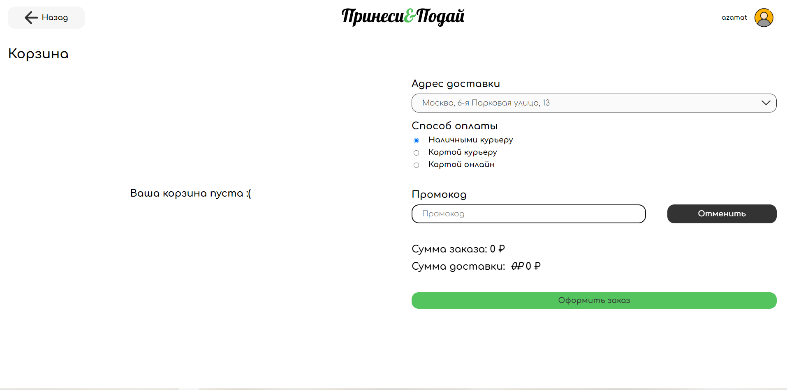
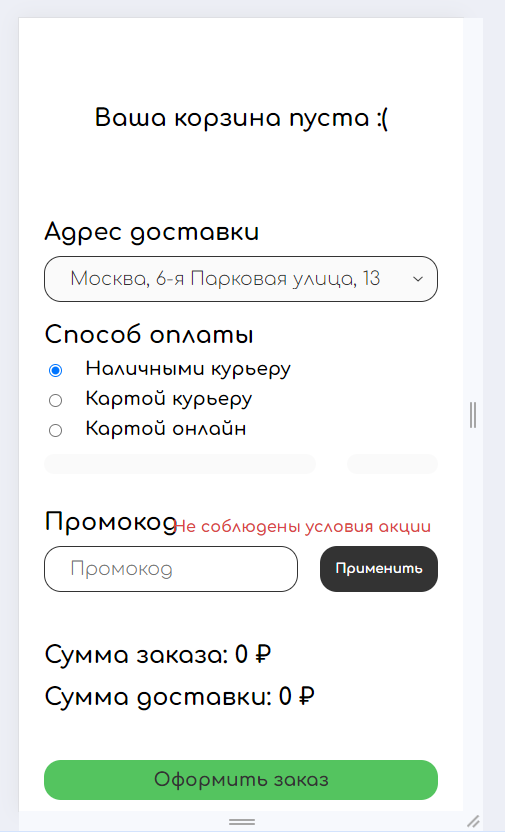
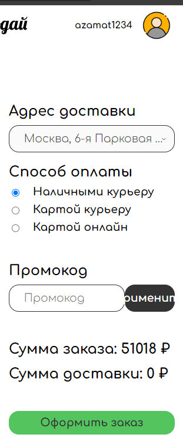

## Промокоды

**Десктоп браузер** - _Google Chrome 121.0.6167.185_ 

**Телефон** - _Android 13 Google Chrome 121.0.6167.178_

- Можно сделать заказ без промокода
- При несуществующем промокоде выходит предупреждение и промокод стирается
- При истёкшом сроке промокода выдаёт соответсвующее сообщение
- **Bug** При заходе в другой профиль с того же браузера, остаются заполненными поля и применены промокоды предыдущего пользователя, причём отменить его нельзя, при этом цена считается, не учитывая его. После этого невозможно вообще ничего поменять в области промокодов
- **Bug** При оформлении заказа и повторном заходе в корзину, промокод не стирается, а сумма доставки меняется с 0 на 0
- **Bug** При повторном оформлении заказа действие старого промокода сохраняется

     

- Промокод "PRINESYFREE" обнуляет сумму доставки
- **Bug** Промокод "PRINESYFREE" можно использовать сколько угодно раз
- Промокод "SHYSH30" уменьшает сумму заказа на 30% без учета доставки

## Промокоды ресторанов

- Промокоды корректно меняют сумму заказа на странице, согласно цифре, укзанной в промокоде
- **Bug** Применение промокода не влияет на итоговую цену заказа после оформления
- **Bug** Промокоды можно использовать много раз, если не обновлять страницу, а просто переходить между рестораном, корзиной и оформлять заказ
- После обновления страницы промокод нельзя применить снова, если он уже был применен

## Верстка
- **Bug** на телефоне при истёкшем промокоде предупреждение заезжает на лейбл

    

- При уменьшении ширины страницы до 900 пикселей всё отлично.
- **Bug** С 900-т пикселей текст кнопки применения начинает не влезать в кнопку.
   
    
    
- С 640 пикселей оформление переходит под корзину, верстка в порядке до 335
- **Bug** С 335 снова текст кнопки не влезает
