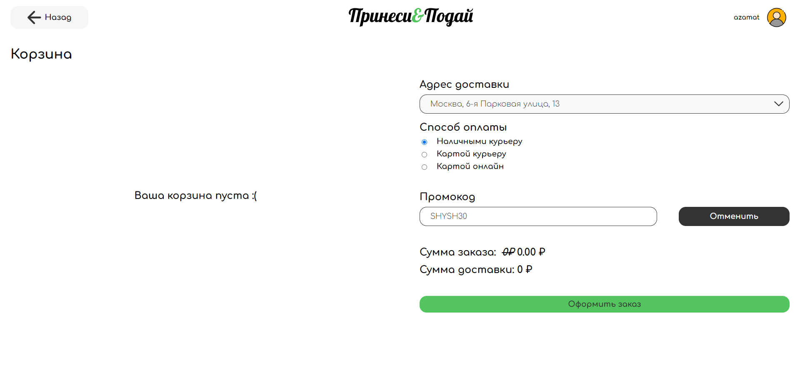

## Промокоды

**Десктоп бразуер** - _Google Chrome 121.0.6167.185_ 

**Телефон** - _Android 13 Google Chrome 121.0.6167.178_

- Можно сделать заказ без промокода
- При несуществующем промокоде выходит предупреждение и промокод стирается
- При истёкшом сроке промокода выдаёт соответсвующее сообщение
- **Bug** При заходе в другой профиль с того же браузера, остаются заполненными поля и применены промокоды предыдущего пользователя, причём отменить его нельзя, при этом цена считается не учитывая его. После этого невозможно вообще ничего поменять в области промокодов

## "PRINESYFREE"

- Промокод "PRINESYFREE" обнуляет сумму доставки
- **Bug** При оформлении заказа и повторном заходе в корзину, промокод "PRINESYFREE" не стирается, а сумма доставки меняется с 0 на 0
 
- **Bug** При повтороном оформлении заказа, действие старого промокода "PRINESYFREE" сохраняется
- **Bug** Промокод "PRINESYFREE" можно использовать сколько угодно раз

## SHYSH30

- Промокод "SHYSH30" уменьшает сумму заказа на 30% без учета доставки
- **Bug** При оформлении заказа и повторном заходе в корзину, промокод "SHYSH30" не стирается, а сумма заказа меняется с 0 на 0
 
- **Bug** При повтороном оформлении заказа, действие старого промокода "SHYSH30" сохраняется
- Промокод "SHYSH30" нельзя использовать больше одного раза

## Промокоды ресторанов

- Промокоды корректно меняют сумму заказа на странице заказа 
- **Bug** Применение промокода не влияет на итогову цену заказа после оформления
- **Bug** Промокоды можно использовать много раз, если не обновлять страницу, а просто переходить между рестораном, корзиной и оформлять заказ
- После обновления страницы промокод нельзя применить снова, если он уже был применен

- **Bug** Промокоды нельзя комбинировать

## Вёрстка
- **Bug** на телефоне при истёкшом промокоде предупреждение заезжает на лейбл

- Мобильный адаптив поддерживается