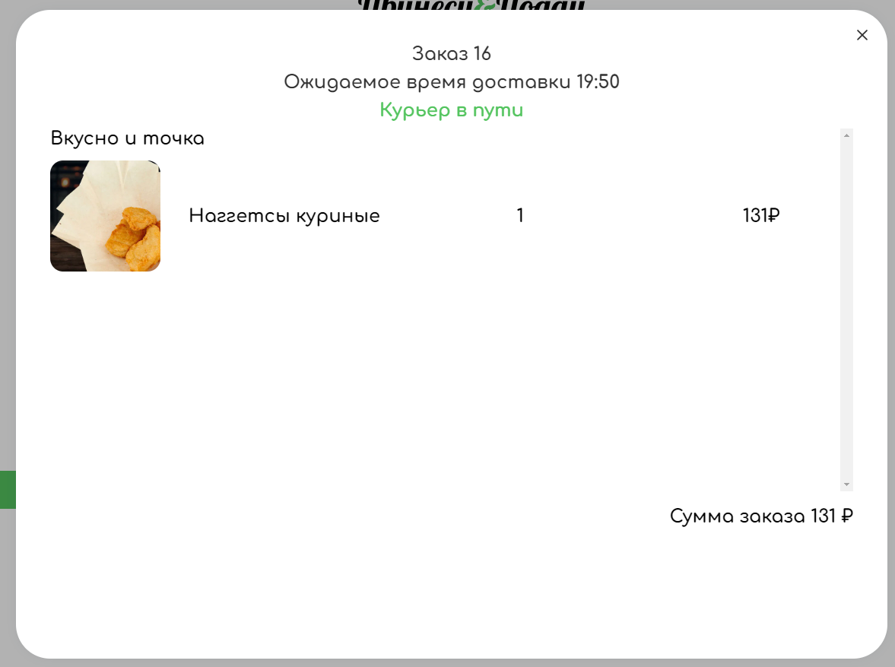
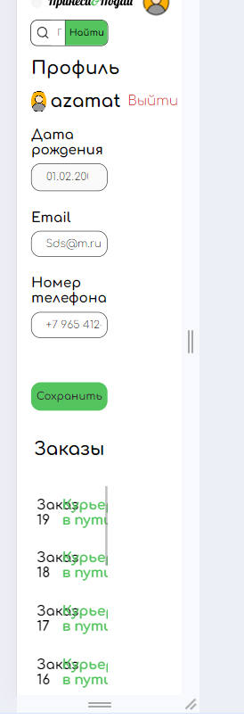

## Статус и история заказов

**Десктоп бразуер** - _Google Chrome 121.0.6167.185_ 

**Телефон** - _Android 13 Google Chrome 121.0.6167.178_

## История заказов
- История скроллится корректно
- Заказы выводятся в убывающем порядке по дате заказа
- При отсутсвии заказов имеется корректное сообщение
- У заказов меняется статус в зависимости от стадии доставки
- **Bug** статус заказа меняется только при обновлении страницы

## Страница заказа
- При нажатии на заказ корректно вылезает модалка
- При нажатии вне области модалки, модалка закрывается
- При нажатии на кнопку крестика модалки, она закрывается 
- **Bug** длительность времени доставки заказа всегда одинаково и не меняется в зависимости от времени, указанном в главном меню. Всегда 30 мин
- При множестве товаров, скроллятся корректно
- **Bug** скроллбар имеется независимо от того, есть ли в нём необходимость (если кол-во товаров недостаточно)

## Вёрстка 
- **Bug** При изменении длины в мобильной версии статус заказа заходит на номер заказа

- **Bug** При изменении длины в страница статуса заказа количество товара заходит на название товара

- Мобильный адаптив поддерживается