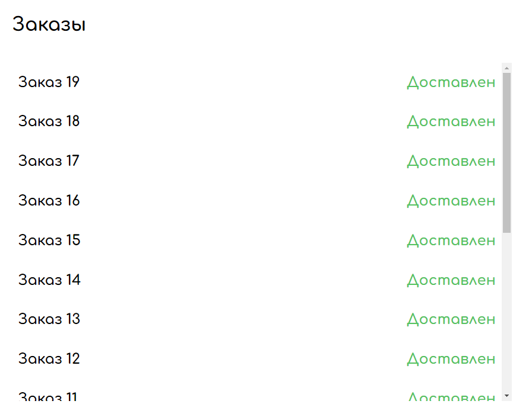
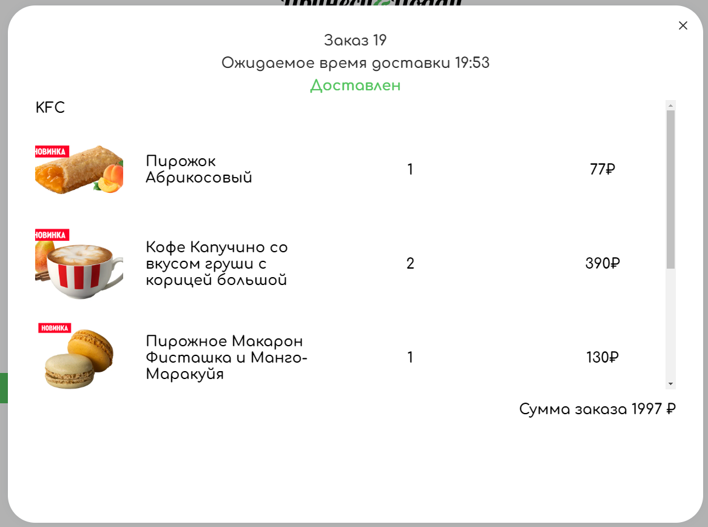
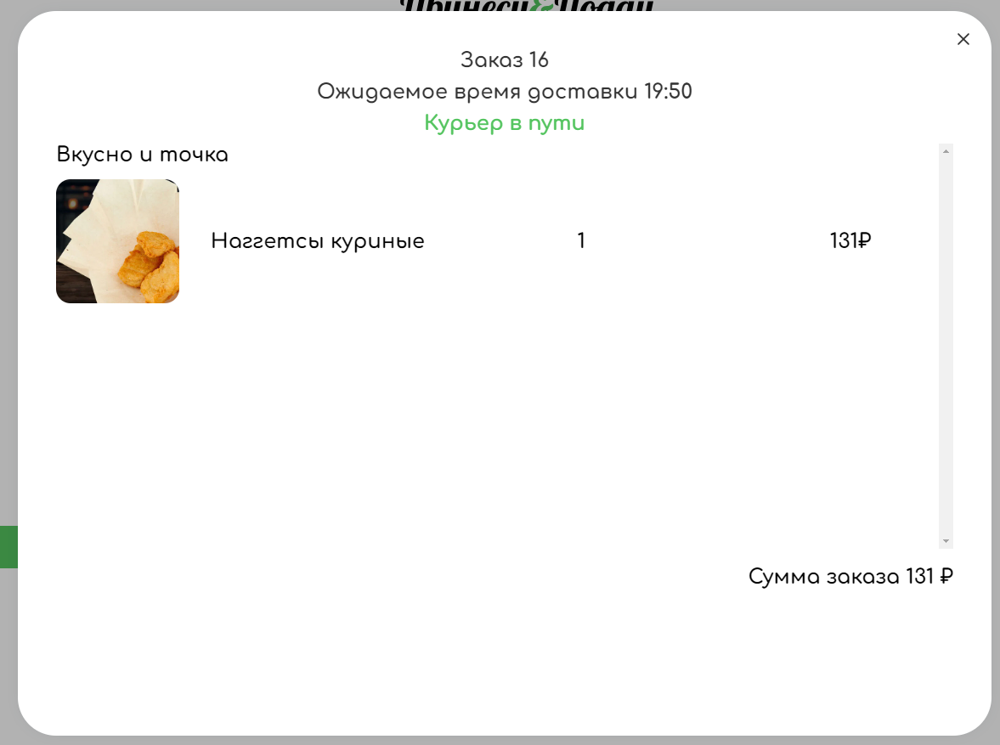
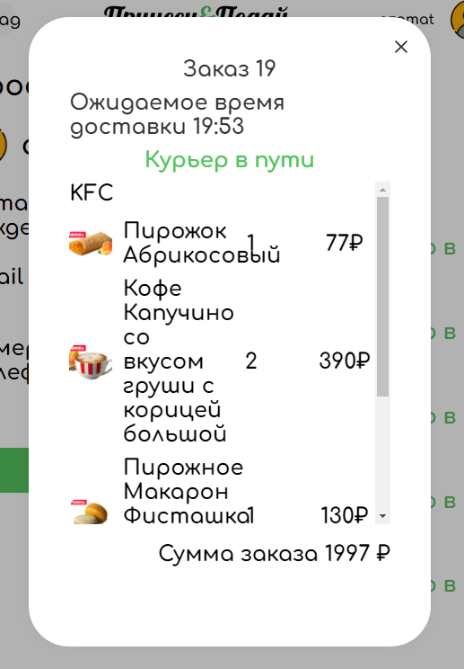
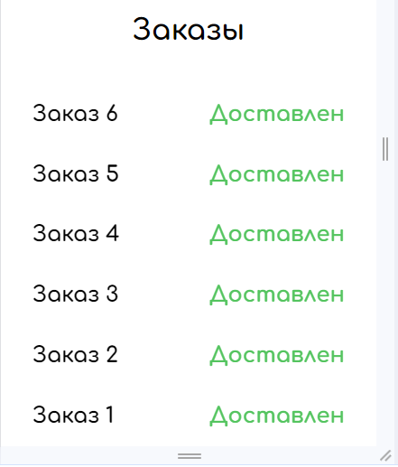

## Статус и история заказов

**Десктоп браузер** - _Google Chrome 121.0.6167.185_ 

**Телефон** - _Android 13 Google Chrome 121.0.6167.178_

## История заказов
- История скроллится корректно
- Заказы выводятся в убывающем порядке по дате заказа
- При отсутствии заказов имеется корректное сообщение "У вас нет заказов:("
- **Bug** Если выйти из аккаунта, где заказы имеются и в том же браузере зайти в аккаунт, где заказов нет, то у второго аккаунта в истории будут заказы первого до обновления страницы
- У заказов меняется статус в зависимости от стадии доставки

    

- **Bug** Статус заказа меняется только при обновлении страницы

## Страница заказа
- При нажатии на заказ корректно вылезает модалка

    

- При нажатии вне области модалки, модалка закрывается
- При нажатии на кнопку крестика модалки, она закрывается 
- **Bug** Длительность времени доставки заказа всегда одинакова и не меняется в зависимости от времени, указанного в главном меню. Всегда 30 мин
- Если товаров много, список скролится
- **Bug** Скроллбар имеется независимо от того, есть ли в нём необходимость (если кол-во товаров недостаточно)

    

## Верстка 
- **Bug** При изменении ширины страницы статуса заказа количество товара заходит на название товара

    

- При изменении ширины окна, надписи постепенно сдвигаются до 640px
- C 640 история заказов переходит под страницу профиля и дальше уменьшается корректно до 300-т

    