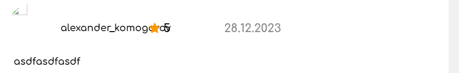
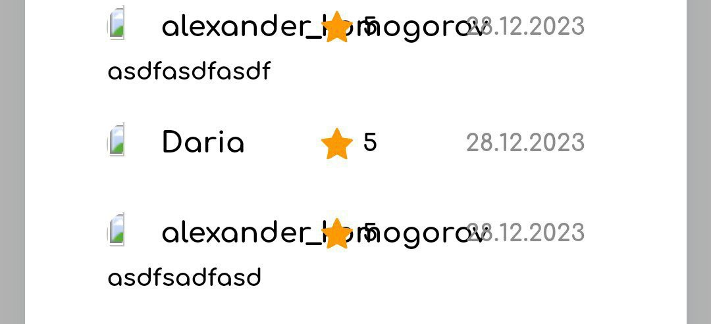

## Отзывы

**Браузер** - _Google Chrome 121.0.6167.185_  
**Мобилка** - _Android Google Chrome 121.0.6167.178_

### Список отзывов

- Список отзывов скроллится
- **Bug** У аккаунтов, созданных 28.12.2023 и ранее, не отображаются аватарки
- **Bug** Длинное имя пользователя наезжает на оценку, на мобилке наезжает также на дату
- 
- 
- Кол-во отзывов совпадает с кол-вом, указанным в шапке ресторана
- **Bug** На мобилке скроллится страница при открытой модалке

### Создание отзыва

- Нельзя оставить отзыв без оценки
- При отсутствии оценки появляется соответствующая ошибка
- Можно оставить отзыв без текста
- **Bug** Можно оставлять несколько отзывов на ресторан с одно аккаунта
- **Bug** Счетчик числа отзывов после создания отзыва обновляется только при обновлении страницы или перезахода на нее
- **Bug** Рейтинг ресторана после создания отзыва обновляется только при обновлении страницы или перезахода на нее
- **Bug** При создании отзыва можно ставить переносы строки, но в списке отзывов они заменяются на пробелы
- **Bug** При заполнении формы отзыва, ее закрытии и открытии в другом ресторане сразу открывается форма отзыва с прошлыми данными
- Не проходит XSS
- **Bug** На мобилке скроллится страница при открытой модалке
