# Главная

Смотрел веб на хроме версии 121.0.6167.184, мобилку - в эмуляторе этого же хрома.

## Карточка ресторана
### Функционал
- Карточка отображает актуальную информацию о ресторане: фото, рейтинг, инфо о доставке.

    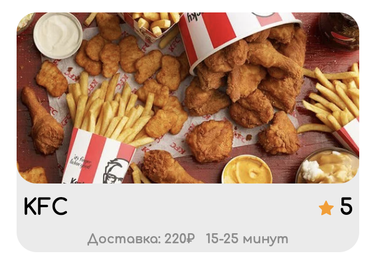

- Клик в любое место карточки редиректит на страницу соответсвующего ресторана.
- **Bug** Переходим с главной на какую-нибудь страницу ресторана, возвращаемся на главную, переходим на страницу другого ресторана. В результате замечаем, как при втором переходе страница предыдущего ресторана заменяется (быстро, но заметно) на страницу нового.
Ожидание: при любом редиректе не заметно никакой смены содержимого на конечной странице ресторана.

    https://cloud.mail.ru/public/WAL1/bSenhLnKk

### Верстка
- Фото ресторана растягивается, заполняя всё отведенное пространство и сохраняя соотношение сторон.
- Фото масштабируется при изменении размера экрана.
- **Bug** При переносе названия ресторана на несколько строк, высота карточки увеличивается. Из-за этого увеличивается высота всех карточек в ряду, содержащем такую карточку. На увеличенных таким образом карточках возникает отступ от верха до фотографии.
Ожидание: у длинного названия, разделенного на две строки уменьшается шрифт, оно занимает максимум две строки, если не вмещается - обрезается троеточием. Все карточки одного размера, отступов сверху до фотографии нет.

    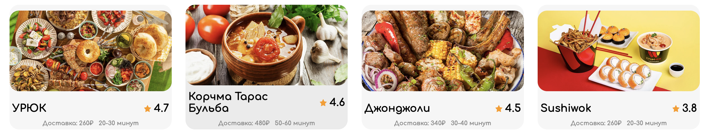

- **Bug** Текст с информацией о стоимости и времени доставки слишком большой при маленьком размере экрана (шириной около 600-700 пикселей), прижимается к левому краю карточки.
Ожидание: текст на маленьком экране меньшего размера, находится по середине карточки, информация о времени доставки смещается на новую строку.

    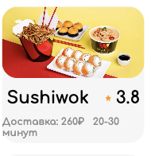

- **Bug** На экране шириной менее 750 пикселей и до включения мобильной верстки (640 пикселей) все карточки в заполненном ряду имеют разную ширину.
Ожидание: карточки при любой ширине экрана имеют одинаковую ширину.

    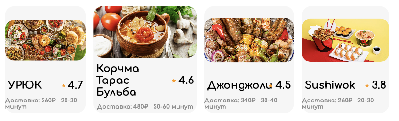

- **Bug** Звезда внутри карточки расположена ниже центра числа рейтинга ресторана,
при небольшой ширине экрана, звезда очень маленькая. При ширине 670px звезда может налезать на название.
Ожидание: звезда и число рейтинга выровнены по центру высоты, размеры звезды и текста в карточке согласованы. Звезда никогда не налезает на название.

    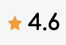
    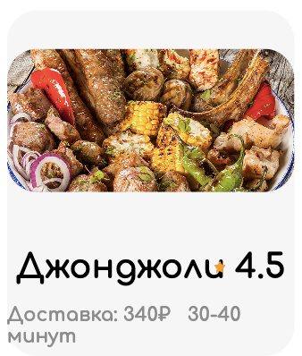
    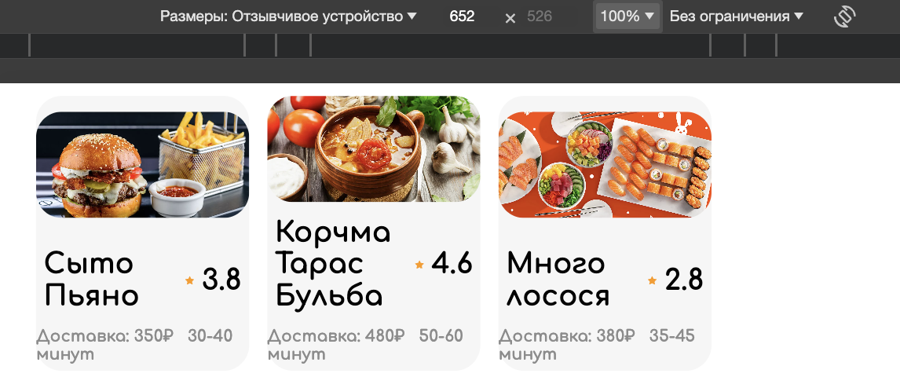

- **Bug** Размер текста в карточке не меняется с размером экрана (видно на всех предыдущих скринах).
Ожидание: текст масштабируется

## Переключатель категорий
### Функционал
- Выбранная категория выделяется черным фоном в переключателе.

    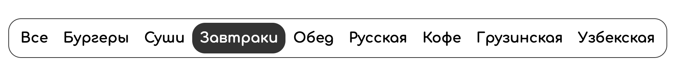

### Верстка
- **Bug** Переключаемся на категорию, где список ресторанов имеет небольшой размер, чтобы можно было доскролить до конца и при этом переключатель останется видимым. Переключаемся на категорию, где список ресторанов имеет другую высоту. Получаем скачок переключателя вверх или вниз. Чтобы нажать снова, нужно двигать курсор по вертикали.
Ожидание: переключатель остается на том же месте.

    https://cloud.mail.ru/public/NmZw/NfVWZ6fXB

- **Bug** На небольших экранах ползунок скрола на переключателе не стилизван и выходит в крайнем положении за границы переключателя.
Ожидание: скролл стилизован и не выходит за границы.

    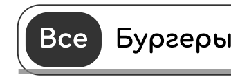

- **Bug** При скроле переключателя содержимое врезается в границы.
Ожидание: прозрачность содержимого уменьшается при приближении к границе.

    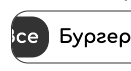

- **Bug** В мобильной версии размер шрифта в названиях категорий в переключателе слишком большой.

    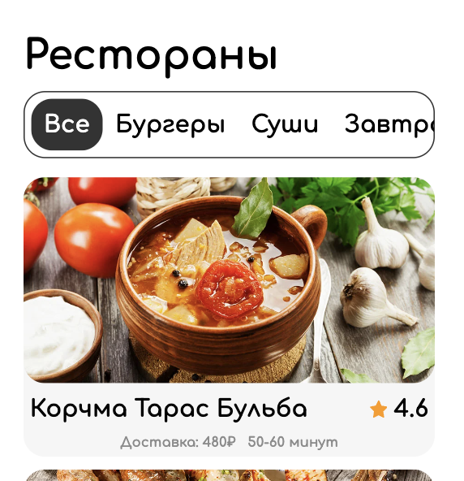

    Ожидание: 

    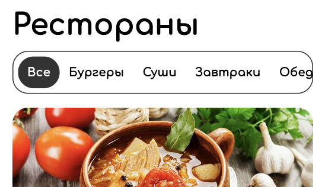

## Раздел категорий
### Функционал
- Список ресторанов меняется в соответствии с выбираемой категорией, название категории слева от переключателя меняется.
- Рестораны в списке отсортированы в порядке убывания рейтинга.

    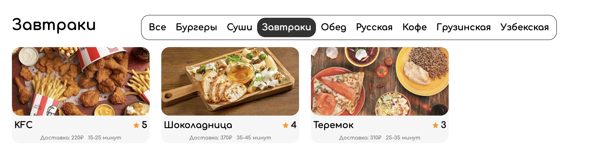

### Верстка
- **Bug** Вертикальные отступы в сетке ресторанов имеют разную величину для разных категорий.
Ожидание: вертикальные отступы одной величины.
Вызвано тем, что отступы заданы в процентах от высоты контейнера, которая меняется в зависимости от количества ресторанов в категории

    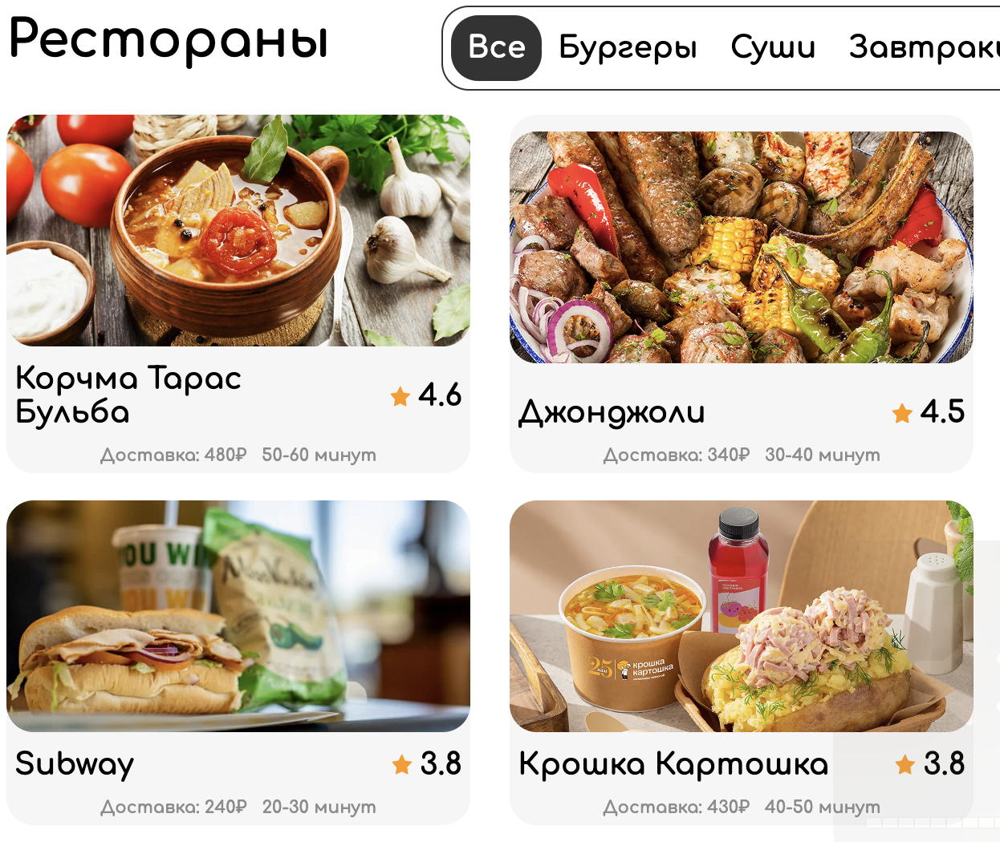
    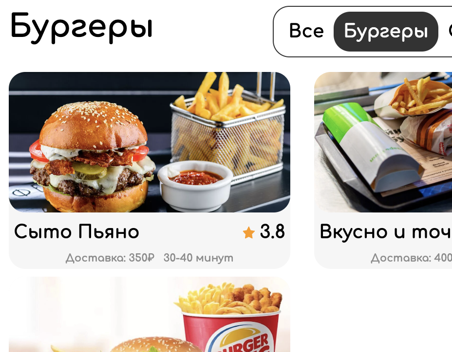

## Раздел рекомендаций

### Функционал
- Для неавторизованного пользователя отображается случайная выборка ресторанов
- Для авторизованного пользователя отображается список ресторанов, из которых он чаще всего заказывает
- Для авторизованного пользователя, который ещё ничего не заказывал, отображается случайная выборка ресторанов

    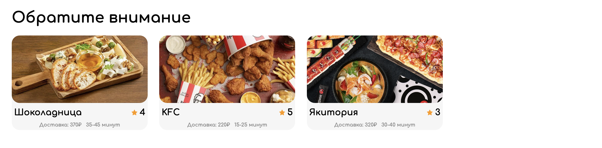

- **Bug** При обновлении страницы неавторизованным пользователем список рекомендованных ресторанов изменяется.
Ожидание: список меняется не при обновлении страницы, а по истчении определенного промежутка времени.
- **Bug** 
    В списке рекомендаций рестораны не отсортированы по рейтингу.
Ожидание: отсортированы по убыванию рейтинга.

## Вся страница

### Верстка
- **Bug** Отступ между списком рекомендаций и списком категорий слишком большой.

    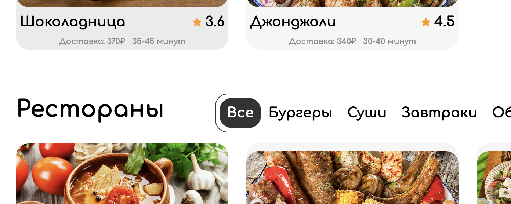

    Отступ ожидается равным отступу от переключателя до сетки ресторанов - 15px.

    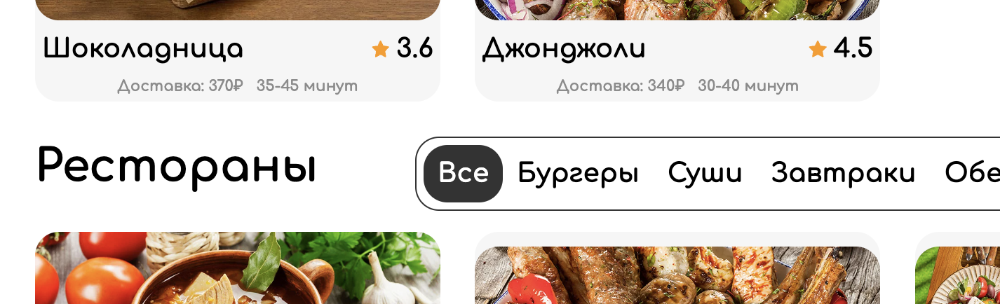
    
- **Bug** В мобильной верстке с 640px до 460px присутствуют два поиска, ожидается только нижний.

    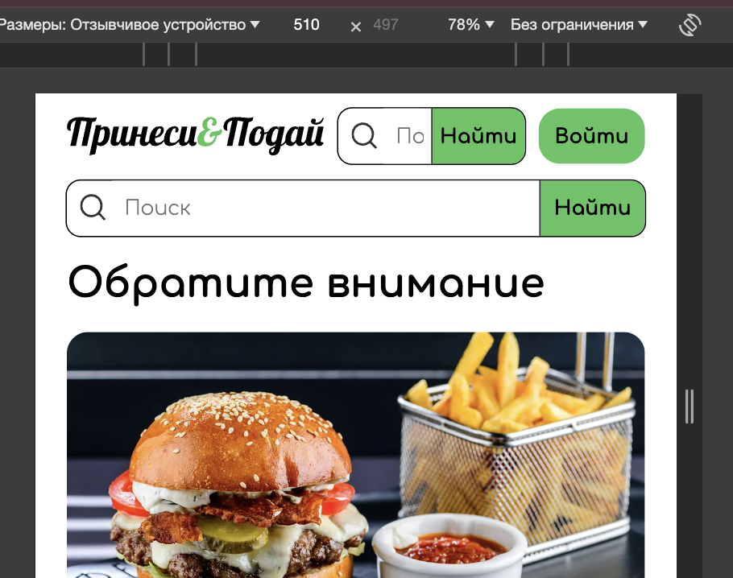

- **Bug** В мобильной верстке для авторизованного пользователя с 640px до 460px навбар шире содержимого страницы. Ожидание: лишние элементы навбара исчезают при переходе границы 640px.

    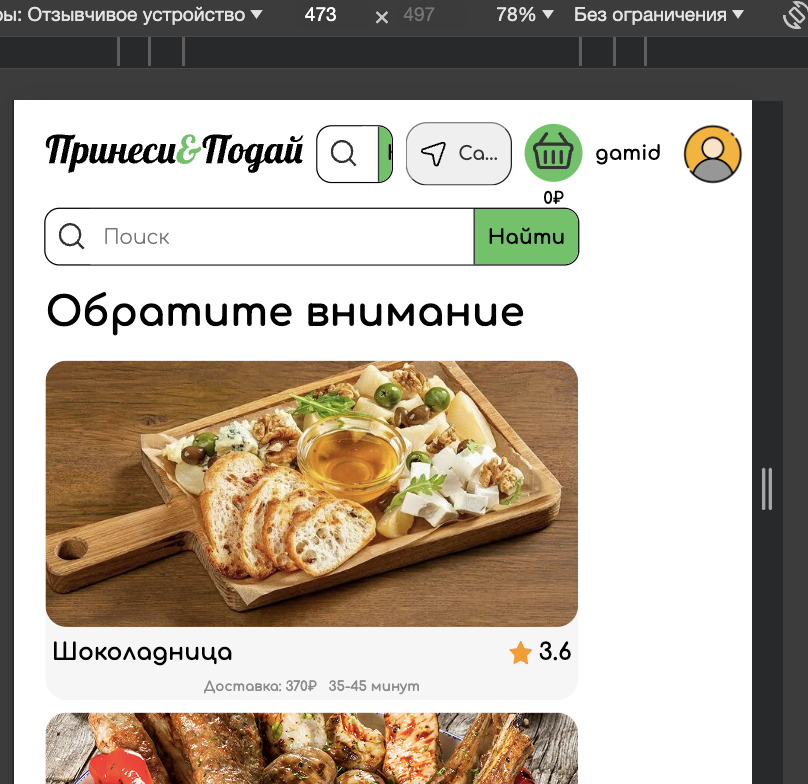

- **Bug** Надписи не масштабируются.
- **Bug** Навбар не прибит к верху страницы.