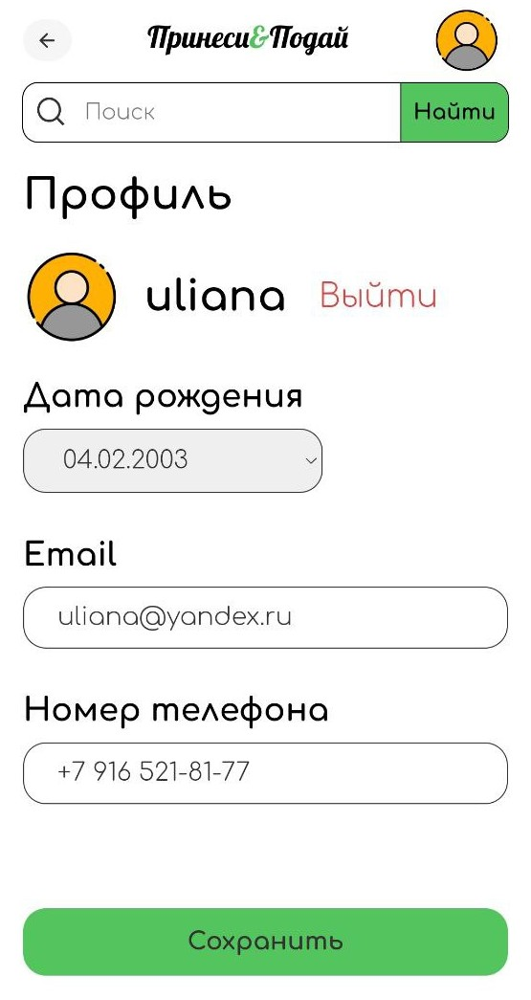
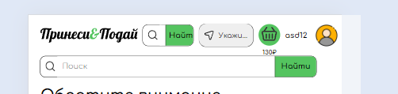

## Навбар

**Браузер** - _Google Chrome 121.0.6167.185_  
**Мобилка** - _Android Google Chrome 121.0.6167.178_

### Навигация

- При переходе на страницу профиля исчезают кнопки профиля, корзины, адреса, поиск; лого смещается в центр, появляется кнопка возврата на предыдущую страницу
  - **Bug** На мобилке остается поле поиска  
    
- При переходе на страницу корзины исчезают кнопки профиля, корзины, адреса, поиск; лого смещается в центр, появляется кнопка возврата на предыдущую страницу
  - **Bug** На мобилке остается поле поиска  
    
- При нажатии на лого происходит редирект на главную
- **Bug** В диапазоне ширины 460-640px в навбаре отображается два поля поиска
- 
- **Bug** При нажатии кнопки назад после редиректа на профиль после оформления заказа происходит переадресация на пустую корзину. Ожидаемое поведение - редирект на главную страницу.

### Синхронизация

- Текущий адрес доставки синхронизирован с корзиной
- Аватарка синхронизирована с профилем
- Сумма товаров в корзине синхронизирована с корзиной
