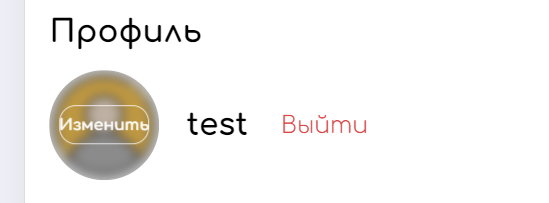
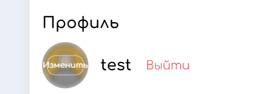
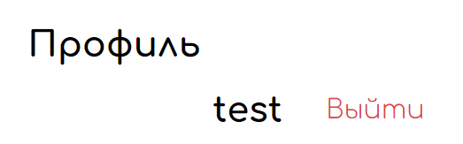
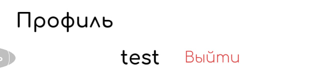
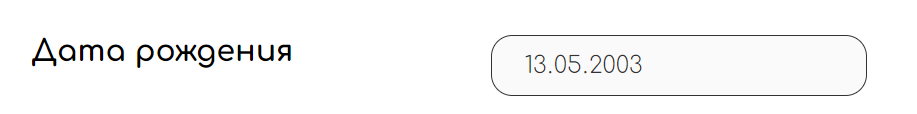
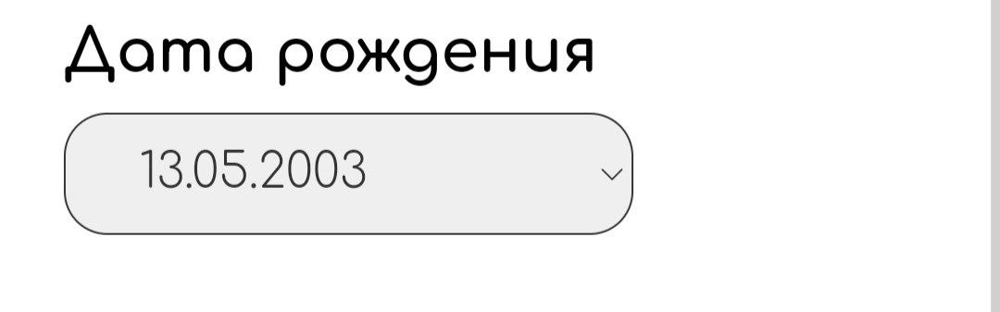
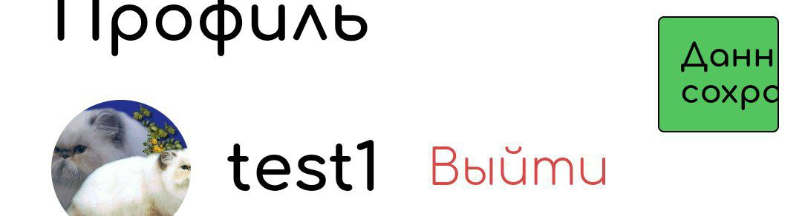

## Профиль

**Браузер** - _Google Chrome 121.0.6167.185_  
**Мобилка** - _Android Google Chrome 121.0.6167.178_

### Пользовательские данные. Аватарка

- У нового пользователя отображается аватарка по умолчанию
- При наведении на аватарку появляется ховер (блюр и кнопка "изменить")
  - **Bug** При ширине экрана меньше 1300px надпись "изменить" начинает прилипать к границам кнопки. При дальнейшем уменьшении ширины надпись выходит за границы кнопки. Ожидаемое поведение - пропорциональное уменьшение шрифта при уменьшении разрешения.
    - Ширина 1300px
    - 
    - Ширина < 1300px
    - 
  - **UX Bug** На мобилке ховер появляется при нажатии на аватарку / зажатие и свайп по аватарке (при нажатии сразу открывается окно выбора фотографии) и пропадает только при клике вне аватарки. Пользователю может быть непонятно, что аватарка обновляется при нажатии на нее
- При нажатии на кнопку изменения аватарки появляется системный интерфейс выбора файла для загрузки на сайт
- Предлагаемые раширения загружаемых файлов _jpg, jpeg, png_
  - **Bug** Возможно загрузить файл с расширением gif, который будет корректно отображаться
  - **Bug** Возможно загрузить файл с любым расширением, отсутствует сообщение об ошибке при загрузке не изображения, ховер искажается
    - Загрузка файла xml
    - 
    - Ховер
    - 
- Загруженное изображение сразу отображается
- При обновлении страницы загруженное изображение сбрасывается
- Изменение аватарки применяется после нажатия кнопки "сохранить"
  - **Bug** После нажатия "сохранить" пару секунд видна предыдущая аватарка

### Пользовательские данные. Дата рождения

- Дата рождения соотвествует дате, указанной при регистрации
- Дата рождения отображается в формате ДД.ММ.ГГГГ
  - **UX Bug** Дата выводится в неизменяемый инпут. У пользователя может сложиться впечатление, что дата является изменяемым полем
  - 
  - **UX Bug** На мобилке дата выводится в дропдаун, проблема аналогична предыдущему пункту
  - 

### Пользовательские данные. Email

- Можно редактировать email
- Адрес, состоящий из латиницы, считается корректным
- Адрес, содержащий кириллицу, в правой части считается корректным
- Адрес "@" не является корректным
- Адрес вида "\*@" не является корректным
- Адрес вида "@\*" не является корректным
- **Bug** В левой части допускаются символы, отличные от букв, цифр и ".". Например _-+%#/@gmail.com_
- Невозможно сохранить пустой адрес
- Невозможно сохранить адрес, совпадающий с адресом другого пользователя
- При обновлении страницы изменения email сбрасываются
- Изменения email применяются после нажатия "сохранить"

### Пользовательские данные. Номер телефона

- Можно редактировать номер телефона
- Телефон определяется маской +7 9\_\_ \_\_\_-\_\_-\_\_. Невозможно ввести телефон отличный от формата маски
- При вставке текста маска сохраняется, лишние символы обрезаются с конца
- Невозможно ввести символы, отличные от цифр
- Невозможно сохранить пустой телефон
- Невозможно сохранить телефон, совпадающий с телефоном другого пользователя
- При обновлении страницы изменения телефона сбрасываются
- Изменения телефона применяются после нажатия "сохранить"

### Пользовательские данные. Подтверждение изменений

- При валидных данных в углу появляется поп-ап об успешком сохранении
  - **Bug** На мобилке поп-ап обрезается справа
  - 
- При совпадении уникальных данных (телефон, email) появляется сообщение о совпадении
  - **UX Bug** Сообщение вида "Совпадает _поле_" не является достаточно информативным

### Логаут

- Модалка логаута появляется при нажатии кнопки "выйти"
- Модалка закрывается по крестику
- Модалка закрывается при нажатии вне модалки
- При подтверждении логаута происходит редирект на главную страницу
- **Bug** При открытой на мобилке модалке логаута можно скроллить основную страницу https://drive.google.com/file/d/1aWzKxbyynXa3vWp2DOJNNPu5-aVtMRCl/view?usp=sharing (видео было записано в эумляторе десктопного хрома)
