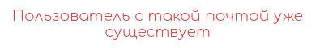
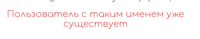
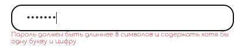
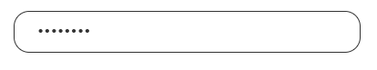
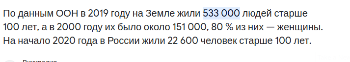
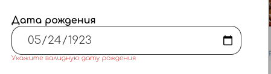

## Авторизация и регистрация

**Браузер** - _Google Chrome Version 121.0.6167.160_  
**Мобильная версия** - _Google Chrome Version 15.5.58.28.arm64_

## Регистрация 

### Поле e-mail

- При заполнении реальным e-mail регистрация проходит успешно
- При пустом поле появляется соотвествующая ошибка
- При заполнении поля невалидной почтой (без символа @) появляется соотвествующая ошибка
- **Bug** При заполнении кириллицей появляется соотвествующая ошибка (хотя есть адреса и с кириллицей)
- При наличии в базе введенной почты выдается ошибка о том, что такая почта уже существует
- **Bug** При замене почты и последующем переходе на следующую страницу регистрации ошибка не исчезает (исчезает только после повторного нажатия кнопки "Зарегистрироваться")  
 

### Поле имени пользователя

- При заполнении латиницей и цифрами от 4 до 19 символов регистрация проходит успешно
- При пустом поле появляется соотвествующая ошибка 
- При заполнении кириллицей появляется соотвествующая ошибка
- При заполнении слишком малым/большим количеством символов появляется соотвествующая ошибка
- При заполнении смайликом появляется соотвествующая ошибка 
- При наличии в базе введенного имени  выдается ошибка о том, что такое имя уже существует
- **Bug** При замене имени и последующем переходе на следующую страницу регистрации ошибка не исчезает (исчезает только после повторного нажатия кнопки "Зарегистрироваться")  
  

### Поля пароля и подтверждения пароля

- При заполнении валидным паролем ( латиницей длиннее 8 символов и содержащим хотя бы 1 цифру и 1 букву ) регистрация проходит успешно
- При пустом поле появляется соотвествующая ошибка 
- При несоотвествии полей пароля и повторения пароля появляется соотвествующая ошибка 
- При заполнении кириллицей появляется соотвествующая ошибка
- **Bug** Проходит пароль длиной 8 символов, хотя в выпадающей ошибке написано, что пароль должен быть длиннее 8 символов  
  
  
- **Bug** Текст ошибок прижимается к инпуту  
  
- При заполнении пароля без цифр появляется соотвествующая ошибка
- При заполнении пароля без букв появляется соотвествующая ошибка
- При попытке заполнения очень длинного пароля поле пароля не увеличивается в размере 

### Поле дня рождения

- При вводе дня больше 14 лет назад регистрация проходит успешно
- При попытке ввода дня меньше 14 лет назад выдается ошибка
- **Bug** При попытке ввода дня больше 100 лет назад выдается ошибка, хотя есть люди старше 100 лет  
  
  
- Ввод любых символов, помимо цифр блокируется
- Ввод частично заполненного дня рождения блокируется

### Поле номера телефона

- При вводе валидного телефона (номер без маски +79) регистрация проходит успешно
- При попытке ввода любых символов, кроме чисел, ввод блокируется
- При вводе слишком малого количества цифр  появляется соотвествующая ошибка о невалидном номере
- При наличии в базе введенного номера телефона выдается ошибка о том, что такой номер уже существует

## Авторизация

- При вводе существующего имени и правильного пароля авторизация (и аутентификация) проходит успешно 
- При вводе несуществующего имени или неправильного пароля выдается сообщение "Неправильный логин или пароль"
- При нажатии кнопки "Войти" с незаполненными полями  имени или пароля  выдается сообщение "Неправильный логин или пароль"

# Интеграция 
- После успешной регистрации происходит автоматическая авторизация (успешный вход на главную страницу)
- В случае неуспешного заполнения хотя бы одного из полей, регистрация блокируется
- В случае успешного заполнения всех полей на первой странице регистрации (почта, имя, пароли) при нажатии кнопки "Далее"  произойдет переход на следующую страницу
- В случае неуспешного заполнения хотя бы одного из полей на первой странице регистрации (почта, имя, пароли) при нажатии кнопки "Далее" будут выведены ошибки и переход на следующую страницу не произойдет
- При нажатии кнопки "Уже есть аккаунт?" произойдет переход на страницу авторизации
- При нажатии крестика на модальном окне произойдет закрытие модального окна

# Верстка

- Размер модального окна не изменяется при переключении между авторизацией и регистрацией
- Размер модального окна адаптируется под размер экрана устройства

