# Страница ресторана

Смотрел веб на хроме версии 121.0.6167.184, мобилку - в эмуляторе этого же хрома.

## Карточка блюда
### Функционал

- Для неавторизованного пользователя на карточке отображается кнопка авторизации "Войдите, чтобы заказать".

    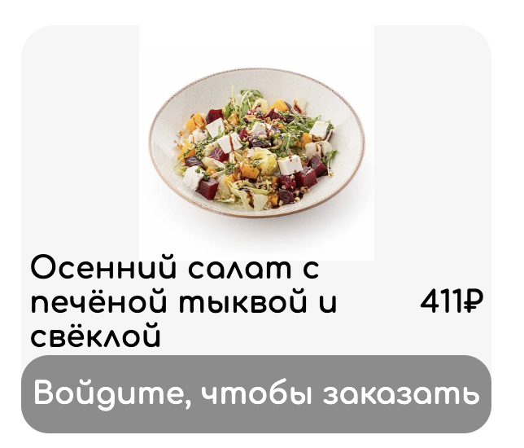

- Нажатие кнопки авторизации открывает модальную страницу авторизации.
- После входа кнопка авторизации заменяется на кнопку "В корзину".
- Для авторизованного пользователя на карточке блюда, которого нет в корзине, отображается кнопка "В корзину".

    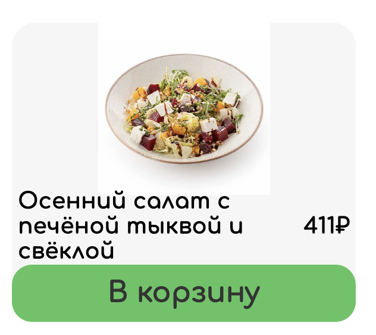

- Если блюдо уже есть в корзине вместо кнопки "В корзину" отображаются кнопки "+" и "-" и количество единиц блюда в корзине.

    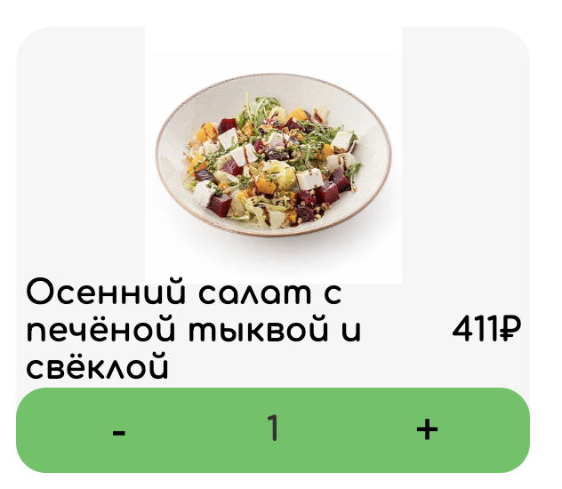

- Кнопка "В корзину" добавляет товар в корзину и сразу обновляется, заменяется на кнопки "+" и "-" и счетчик.
- Кнопки "+" и "-" соответственно добавляют и удаляют из корзины одну единицу блюда.
- Если в корзине одна единица блюда, то нажатие на "-" возвращает на карточку кнопку "В корзину".
- Если в корзине находятся блюда из другого ресторана, то нажание на кнопку "В корзину" вызывает модальную страницу с предупреждением.

    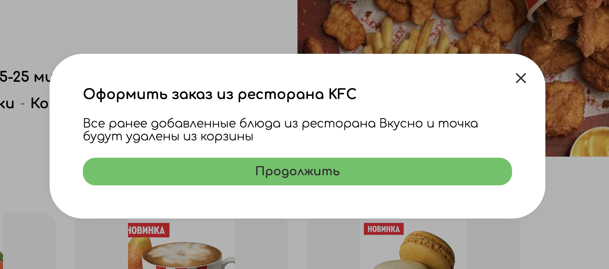

- Нажатие на кнопку "Продолжить" в модальном окне предупреждения очищает корзину от предыдущего содержимого и добавляет соответветсвующее блюдо из текущего ресторана (на которое изначально произведено нажатие).

### Верстка

- Кнопки "В корзину", "+" и "-" затемняются при наведении и нажатии.
- **Bug** Кнопка "Продолжить" на модальной странице с предупреждением об очищении корзины не имеет эффектов наведения и нажатия. Ожидание: эффекты есть.
- **Bug** Название блюда, растягивающееся на три строки, касается фотографии блюда.
Ожидание: у длинного названия, разделенного на две строки уменьшается шрифт, оно занимает максимум две строки, если не вмещается - обрезается троеточием, сохраняется постоянный отступ между фотографией и названием.

    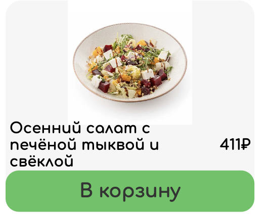

- **Bug** При уменьшении экрана название налезает на другие элементы карточки. Ожидание: карточка уменьшается в масштабе.

    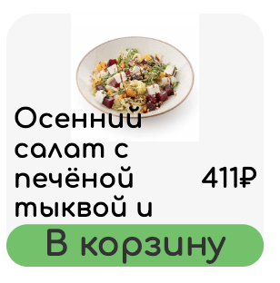

- **Bug** При определенной ширине до перехода к мобильной верстве карточки имеют разную высоту.

    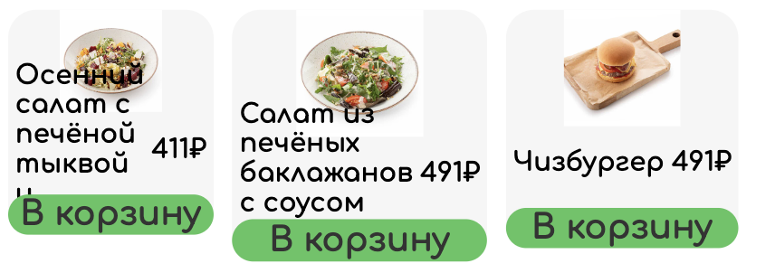

## Шапка ресторана

- Шапка правильно отображает фотографию ресторана с главной страницы, информацию о доставке, рейтинг, категории ресторана и количество отзывов.

    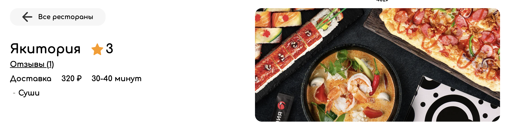

- Нажатие на счетчик отзывов открывает модальное окно с отзывами.
- **Bug** Открываем модальное окно с отзывами, добавляем новый отзыв, закрываем модальное окно. Видим, что количество отзывов не изменилось. Обновляем страницу или уходим с неё и возвращаемся - количество отзывов актуализировалось. Ожидание: счетчик отзывов в шапке обновляется асинхронно при добавлении отзыва, без необходимости перезагружать страницу.
- **Bug** Аналогичный предыдущему баг с рейтингом. Ожидание: асинхронное обновление без перезагрузки страницы.

### Верстка
- Фото ресторана масштабируется, покрывая всю доступную область.
- **Bug** Открыть модалку отзывов можно нажатием справа от счетчика отзывов. Ожидание: открыть модалку можно только нажатием на счетчик или надпись "отзывы".

    https://cloud.mail.ru/public/vECF/BUcMHvnXH

- **Bug** С уменьшением ширины экрана фото ресторана в шапке перекрывается с рейтингом. Ожидание: сохранение отступа между фото и левой частью шапки.

    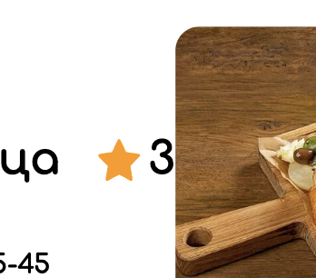

- **Bug** С уменьшением ширины экрана символ рубля и слово "минут" съезжают на новую строку. Ожидание: уменьшение размера шрифта информации о доставке.

    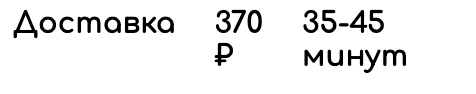

- **Bug** С уменьшением ширины экрана надпись в кнопке возврата прижимается к граница и после выходит за них. Ожидание: уменьшение кнопки в масштабе.

    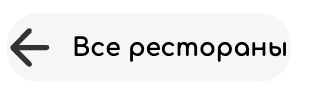
    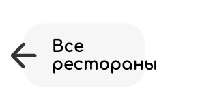

- **Bug** В мобильной версии фото ресторана под информацией о шапке. Ожидание: фото находится после названия ресторана.

    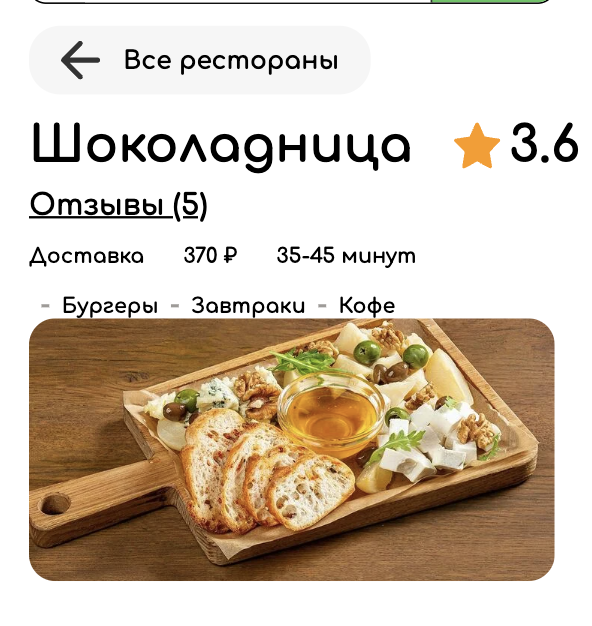

## Категории блюд
- Выводятся все категории соответствующего ресторана.
- Блюда выводятся в определенном порядке, не меняющемся при перезагрузке страницы и не зависящем от конкретного пользователя.

    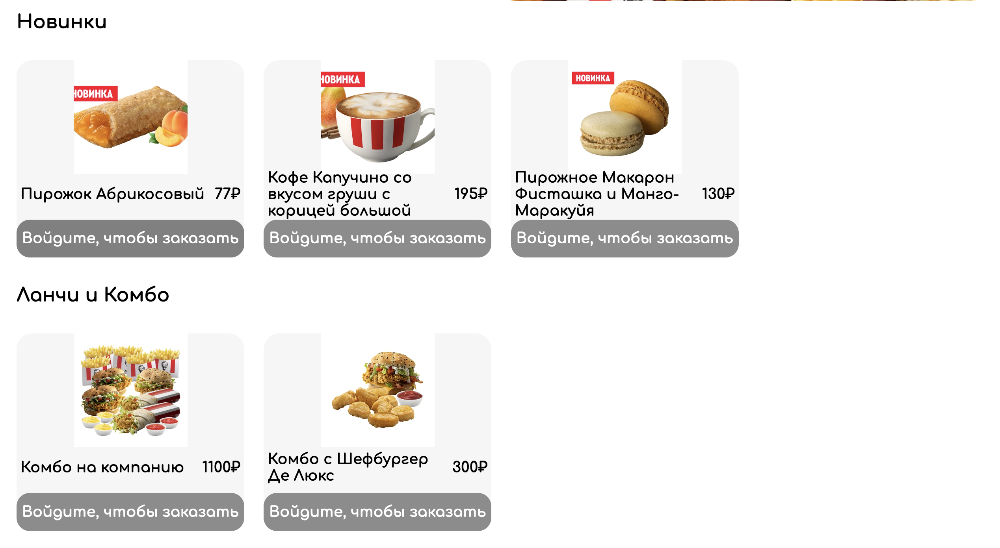

## Вся страница

### Верстка

- **Bug** В мобильной верстке с 640px до 460px присутствуют два поиска, ожидается только нижний.
- **Bug** В мобильной верстке для авторизованного пользователя с 640px до 460px навбар шире содержимого страницы. Ожидание: лишние элементы навбара исчезают при переходе границы 640px.

    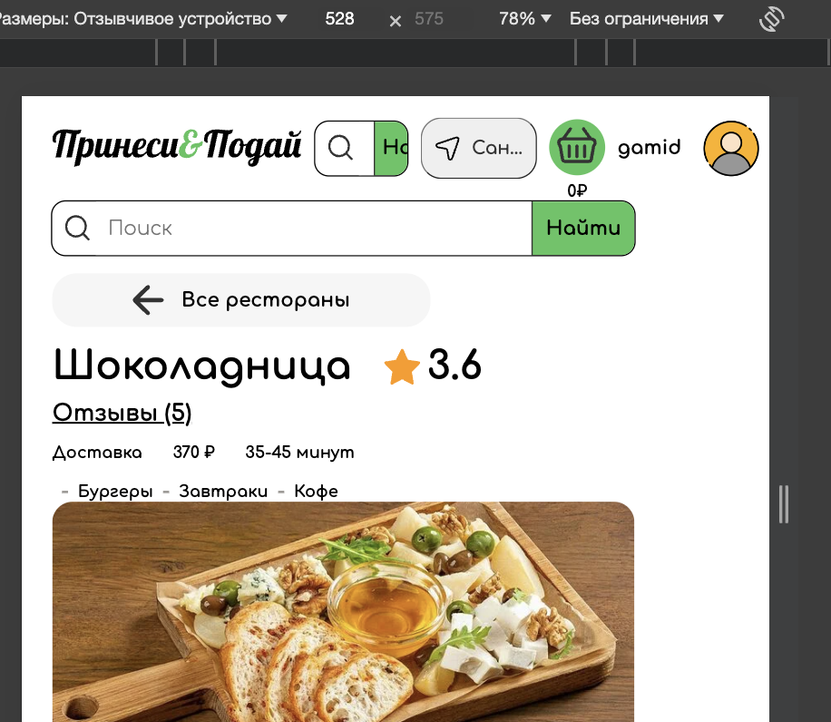

- **Bug** Надписи не масштабируются
- **Bug** Навбар не прибит к верху страницы.